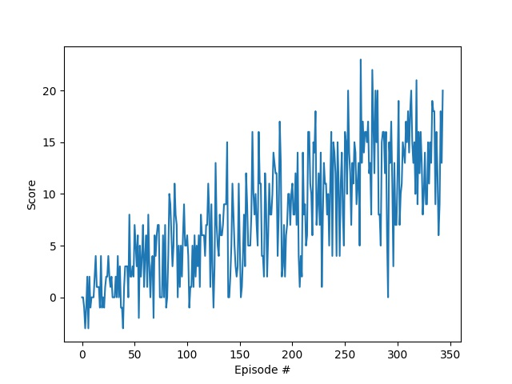
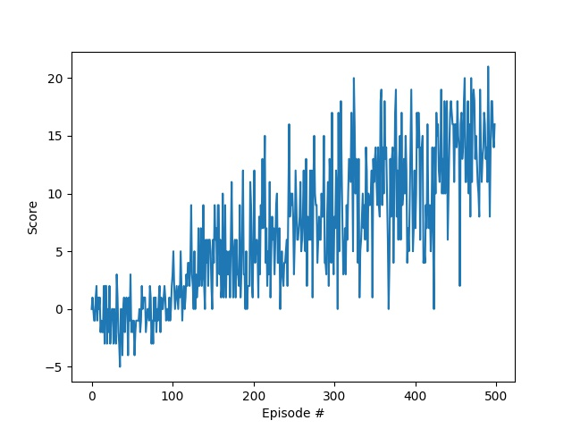

# Project 1 - collecting tasty bananas
To solve the learning task the DQN-algorithm is applied here. It is combination of Q-learning and a deep neural networks as function approximator.

## Q-Learning
Q-learning is a reinforcement learning technique, that solves model-free, continuous tasks. The goal is to maximize the (discounted) future reward. In traditional approaches we have a so called Q-table that is adapted to the collected experience (*state, action, reward, next state, done*). For each state-action combination a Q-table is saved in the Q-table. In each iteration the Q-value of [*state, action*] is updated.

The disadvantage of the traditional approach is, that the Q-table exceeds memory capacities with increasing state and action dimensions. The idea of DQN is approximate the Q-table with a deep neural network.

## DQN Network
For the Q-table approximation two different network architectures are applied.
* **Vanilla**

  *input layer(37) | hidden layer(64) | hidden layer(64) | output layer(4)*

* **Dueling**: As basis the vanilla network is taken. The output layer will be replaced by two streams, that will be later fused together.
  + Value Stream: *hidden layer(1)*
  + Advantage Stream: *hidden layer(32) | hidden layer(4)*

  The outputs are fused together according to the following function.
```
    output = val + (adv - adv.mean())
```

## Hyperparameters
The following hyperparameters are used.
```
  BUFFER_SIZE = int(1e5)  # replay buffer size
  BATCH_SIZE = 64  # minibatch size
  GAMMA = 0.99  # discount factor
  TAU = 1e-3  # for soft update of target parameters
  LR = 5e-4  # learning rate
  UPDATE_EVERY = 4  # how often to update the network
  eps_start = 0.1
  eps_end = 0.0001
```

## Results
  * **Vanilla**: Environment solved in 244 episodes!	Average Score: 13.01
  

  * **Dueling**: Environment solved in 399 episodes!	Average Score: 13.08
  
