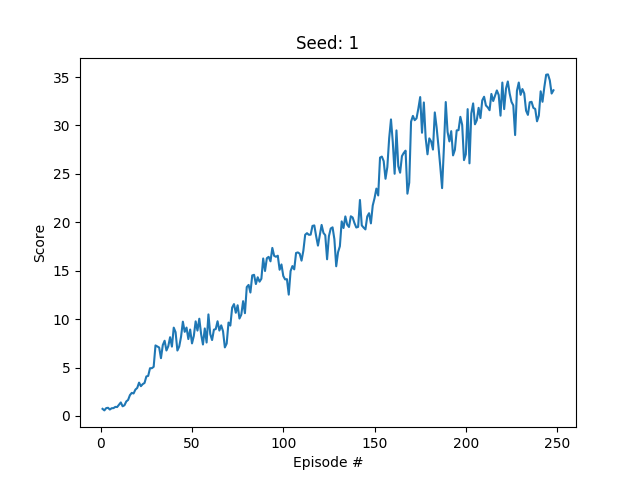

# Project 1 - collecting tasty bananas
To solve the learning task the DDPG-algorithm [1] is applied here. 


## Hyperparameters
The following hyperparameters are used.
```

BUFFER_SIZE = int(1e5)  
BATCH_SIZE = 128  
GAMMA = 0.99  
TAU = 0.001  
LR_ACTOR = 0.0001  
LR_CRITIC = 0.001  
WEIGHT_DECAY = 0.0  

```

## Architecture of Actor Network
```
Input Layer: 33 Neurons
Linear Layer 1: 64 Neurons, ReLu
Linear Layer 2: 64 Neurons, ReLu
Output Layer: 4 Neurons, Tanh
```

## Architecture of Critic Network
```
Input Layer1: 33 Neurons
Linear Layer 1: 64 Neurons, ReLU
Input Layer 2: 64 + 4 Neurons
Linear Layer 2: 64 Neurons, ReLu
Output Layer: 4 Neurons, Tanh
```

## Results
  * Environment solved in ~150 episodes
  
  
## Future Work
I didn't get my implementation with an actual seed running. I tried to set a seed everywhere
possible (simulation env, torch, ...), but still I got different results, when I trained
the agent several times with the same hyperparamters. I had difficulties with
the tuning process and it felt more like luck of getting a good initial state. I.e. Training
with the same hyperparameters failed in one run and succeeded in the next. 
So this would be a first improvement to really be able to tune those parameters systematically.

Further more I'd like to apply PPO [2] and compare the results and the difficulty of 
hyperparameter tuning to DDPG [1].

  
  
## References
  *  [1] DDPG-algorithm: CONTINUOUS CONTROL WITH DEEP REINFORCEMENT LEARNING, Lillicrap et. al., 2016
  *  [2] PPO: Proximal Policy Optimization Algorithms, Schulman et. al., 2017